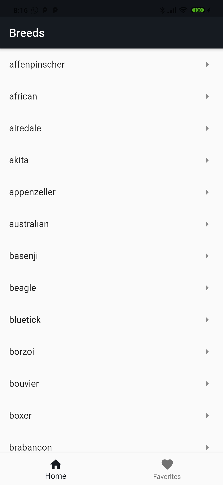
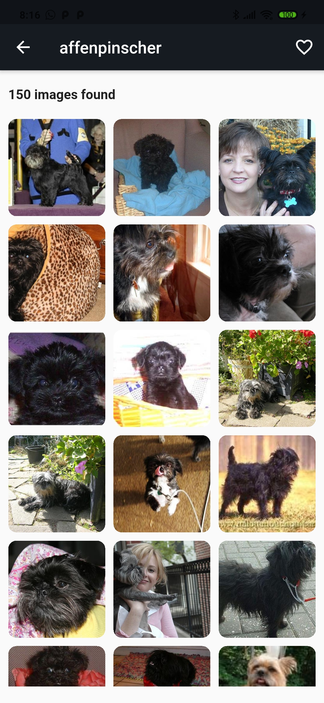
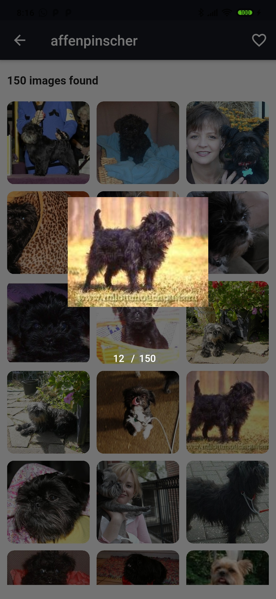
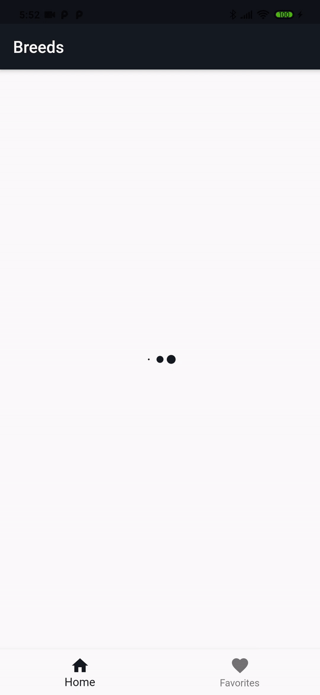

# Doggos

An APP that consumes https://dog.ceo/api and display information of dogs breeds

## Preview

<p float="left">
  
   
  
  
</p>

## Requirements

Dart 2.13.0

Flutter 2.2.0

## Installation

```bash
flutter pub get
```

## Running

```bash
flutter run --express
```
